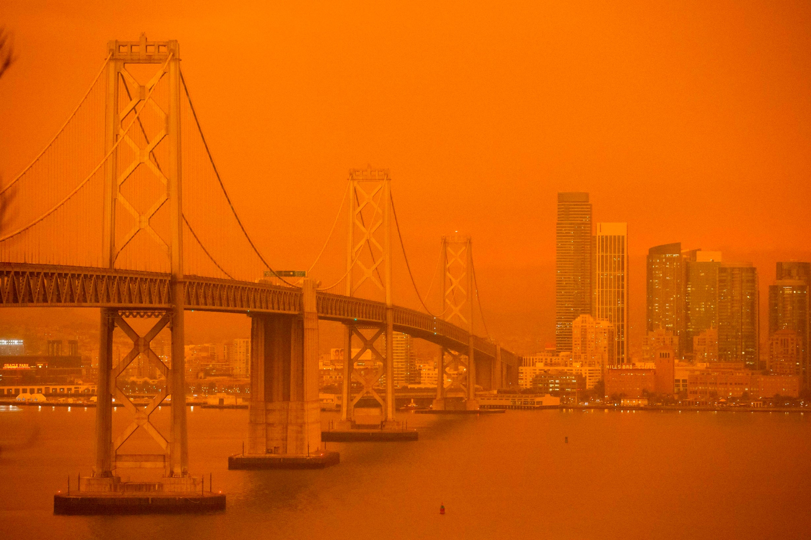

<!-- README.md is generated from README.Rmd. Please edit that file -->

# STA 323 & 523 :: Exam 01

## Introduction

<center>



</center>

*Source*:
<https://www.standard.co.uk/news/world/california-wildfire-orange-sky-san-francisco-a4544106.html>

<br/>

In September, wildfires were raging and racing across parts of the U.S.
west coast. The quantity and intensity of the fires had resulted in some
apocalyptic images (as seen above) in San Francisco, Portland, and
Idaho. The smoke from these storms was pushed as far east as
Pennsylvania. In addition to the destruction caused by the fires, they
also severely impacted the air quality, in and around their epicenters.
In this exam you will investigate and analyze air quality data near and
far from the west coast wildfires.

## Data

Data in your repository contains air quality measurements from three
regions (San Francisco-Oakland-Fremont, Portland-Vancouver-Beaverton,
and Allentown-Bethlehem-Easton) over a 15-day period, beginning
September 1, 2020 UTC time. Measurements are recorded for various
quantities (parameters) of interest at multiple times and locations
within each region.

To get started, read in `air_quality.rds` and create an object named
`air_quality` with the below code. This code is given in your starter
Rmd file.

``` r
air_quality <- readRDS(file = "data/air_quality.rds")
```

Most of the variables are self-explanatory. However, it may be helpful
to do some background research on the various parameters in order to
create more insightful visualizations and produce more interesting
results.

## Essential details

### Deadline and submission

**The deadline to submit Exam 01 is Wednesday, February 24 at 11:59pm
ET.** Only the code in your main branch will be graded. You are not
required to create any additional branches for this individual exam.

### Rules

**Phase I**: Data understanding, Friday, February 19 at 5:00pm - Monday,
February 22 at 10:00am ET

**Phase II**: Tasks, Monday, February 22 at 10:00am - Wednesday,
February 24 at 11:59pm ET

  - This is an individual assignment.

  - Everything in your repository is for your eyes only except for the
    instructor and TAs.

  - You may not communicate anything about this exam to anyone. This
    includes posting or interacting in any online forums.

  - You may read and reference any resources. As always, you must cite
    any code you use as inspiration that is beyond what we introduced
    thus far in the course.

  - For any questions, send a direct message on Slack (or email) to the
    instructor. Questions should only be about understanding the data or
    the exam’s instructions.

### Academic integrity

To uphold the Duke Community Standard:

  - I will not lie, cheat, or steal in my academic endeavors;
  - I will conduct myself honorably in all my endeavors; and
  - I will act if the Standard is compromised.

Duke University is a community dedicated to scholarship, leadership, and
service and to the principles of honesty, fairness, respect, and
accountability. Citizens of this community commit to reflect upon and
uphold these principles in all academic and non-academic endeavors, and
to protect and promote a culture of integrity. Cheating on exams and
quizzes, plagiarism on homework assignments and projects, lying about an
illness or absence and other forms of academic dishonesty are a breach
of trust with classmates and faculty, violate the Duke Community
Standard, and will not be tolerated. Such incidences will result in a 0
grade for all parties involved as well as being reported to the
University Judicial Board. Additionally, there may be penalties to your
final class grade. Please review Duke’s Standards of Conduct.
